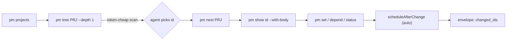

# `pm` — an agent-first CLI for the Project Manager vault

> Design document. Status: **draft for review**. Target: a headless command-line
> tool that lets an AI agent create, read, navigate, update, move, and analyze
> the projects / milestones / tasks / subtasks / dependencies that the Obsidian
> "Project Manager" plugin stores as Markdown, **by reusing the plugin's own
> `src/store` domain code** over a Node filesystem-backed vault adapter.

---

## Table of contents

1. [Vision & principles](#1-vision--principles)
2. [Architecture](#2-architecture)
   - 2.1 [The reuse thesis](#21-the-reuse-thesis)
   - 2.2 [The Obsidian surface the store actually needs](#22-the-obsidian-surface-the-store-actually-needs)
   - 2.3 [`NodeVaultAdapter` + the `obsidian` shim](#23-nodevaultadapter--the-obsidian-shim)
   - 2.4 [Vault discovery & settings](#24-vault-discovery--settings)
   - 2.5 [Process model & packaging](#25-process-model--packaging)
   - 2.6 [The `PmContext` — one store instance per invocation](#26-the-pmcontext--one-store-instance-per-invocation)
3. [Command surface](#3-command-surface)
   - 3.1 [Global flags](#31-global-flags)
   - 3.2 [Discover / read](#32-discover--read)
   - 3.3 [Create](#33-create)
   - 3.4 [Update](#34-update)
   - 3.5 [Structure / analysis](#35-structure--analysis)
   - 3.6 [Delegation map (command → ProjectStore method)](#36-delegation-map-command--projectstore-method)
4. [Output formats optimized for agents](#4-output-formats-optimized-for-agents)
5. [Schemas & formats](#5-schemas--formats)
   - 5.1 [Handle reference scheme](#51-handle-reference-scheme)
   - 5.2 [Entity JSON schemas (`pm schema`)](#52-entity-json-schemas-pm-schema)
   - 5.3 [The declarative `apply` spec](#53-the-declarative-apply-spec)
   - 5.4 [The `batch` op stream](#54-the-batch-op-stream)
6. [Creative power features](#6-creative-power-features)
7. [Safety & correctness](#7-safety--correctness)
8. [Requirements & non-goals](#8-requirements--non-goals)
9. [Open questions](#9-open-questions)
10. [Phased build plan (INT-019+)](#10-phased-build-plan-int-019)
11. [MVP recommendation](#11-mvp-recommendation)

---

## 1. Vision & principles

`pm` is the one-stop shop an AI agent uses to operate a user's Project Manager
vault from a shell. It is **not** a human TUI — there is no interactivity, no
colored spinner, no prompt. Every invocation is a single deterministic
transaction that reads from `argv`/stdin and writes machine-parseable output to
stdout, diagnostics to stderr, and a meaningful integer to `$?`.

**Principles**

1. **Agent-first, not human-first.** The default output is a stable JSON
   envelope. Human-readable rendering is a `--pretty` opt-in, never the default.
   Optimize for *parse reliability* and *token economy*, not for eyeballs.
2. **Reuse the plugin's brain.** Every mutation flows through the exact
   `ProjectStore`/`TaskSource` methods the Obsidian UI uses. ID minting,
   folder-based task association, the dependency scheduler, bidirectional
   rename, project-folder move, self-describing palettes, external-task
   ingestion/backfill hardening, and self-heal-on-load all come *for free*.
   `pm` writes no YAML of its own and re-implements no invariant.
3. **Deterministic & non-interactive.** Same inputs → same bytes out (modulo
   timestamps, which are surfaced explicitly). No command ever blocks on a
   prompt; ambiguity is an error with an actionable message, not a question.
4. **Safe by construction.** Destructive verbs archive (reversible) rather than
   hard-delete; `rm` routes to Obsidian's trash. Every mutation supports
   `--dry-run` and `--explain`. Cycle-forming dependencies are rejected before
   they touch disk.
5. **Machine-parse-optimized & token-frugal.** A scanning view (`[id] status
   title (due)`) costs a fraction of the full note; agents drill down only when
   needed. Streaming (NDJSON) keeps big trees off the heap and inside a
   bounded context window.
6. **Never crash on bad input.** Malformed frontmatter, an unknown status, a
   missing id, a half-written file: the store already tolerates these
   (verbatim-preserve unknown palette values, self-heal orphans, ingest-backfill
   missing ids). `pm` surfaces them as structured `warnings`, not stack traces.
7. **Coexist with the live plugin.** The store's 5-second self-write window and
   cache-invalidation model mean a `pm` write and an open Obsidian view
   reconcile the same way two plugin writes do.

---

## 2. Architecture

### 2.1 The reuse thesis

`ProjectStore` is the entire domain model. It talks to Obsidian **only** through
a narrow slice of three objects — `app.vault`, `app.fileManager`,
`app.metadataCache` — plus a handful of value classes (`TFile`, `TFolder`,
`normalizePath`, `parseYaml`, `Notice`). Nothing in `src/store/**`, `src/types.ts`,
`src/dates.ts`, or `src/utils.ts` reaches for the DOM, the workspace, a `Plugin`
instance, or Electron. (Only `src/main.ts`, `src/views/**`, `src/ui/**`, and
`src/settings.ts` do — and `pm` imports none of those.)

That is the whole opportunity: **if we furnish a real-filesystem `App` and a
real-filesystem `obsidian` module, `ProjectStore` runs unmodified in Node.**
`test/fakeVault.ts` already proves the shape — it is an in-memory `App`-like with
`vault` + `fileManager` + `metadataCache` that the store's own test suite drives
end to end. `NodeVaultAdapter` is that same adapter pointed at real disk.

```
          ┌─────────────────────────────────────────────┐
          │                   pm  (CLI)                  │
          │  argv parse → command → JSON envelope out    │
          └───────────────┬─────────────────────────────┘
                          │ programs against
                          ▼
          ┌─────────────────────────────────────────────┐
          │   src/store  (ProjectStore : TaskSource)     │  ← UNCHANGED plugin code
          │   Scheduler · TaskTreeOps · ArchiveOps ·     │
          │   ProjectConfig · Yaml{Parser,Serializer,    │
          │   Hydrator} · TaskIndex · TaskFilter         │
          └───────────────┬─────────────────────────────┘
                          │ app.vault / app.fileManager / app.metadataCache
                          ▼
          ┌─────────────────────────────────────────────┐
          │   NodeVaultAdapter  +  `obsidian` shim       │  ← NEW, the only new I/O code
          │   real fs ↔ TFile/TFolder mirror             │
          └─────────────────────────────────────────────┘
```

### 2.2 The Obsidian surface the store actually needs

Enumerated by reading every `this.app.*` / `obsidian`-imported reference in
`src/store/**`. This is the **complete** contract `NodeVaultAdapter` must satisfy.

| Object | Member | Used by | Node implementation |
|---|---|---|---|
| `app.vault` | `getMarkdownFiles(): TFile[]` | `discoverProjects` | walk vault dir, return `.md` `TFile`s |
| | `getAbstractFileByPath(path): TAbstractFile\|null` | everywhere | lookup in the path→node mirror |
| | `cachedRead(file)` / `read(file)` | load, ingest, import | `fs.readFile(utf8)` |
| | `process(file, fn)` | full-file rewrites | read → `fn` → atomic write (tmp+rename) |
| | `create(path, content)` | new files | `fs.writeFile`, register `TFile` |
| | `createBinary(path, data)` | attachments | `fs.writeFile(Buffer)` |
| | `createFolder(path)` | `ensureFolder` | `fs.mkdir` |
| | `rename(file, newPath)` | archive, folder move | `fs.rename` (+ re-key mirror, recursive for folders) |
| | `on(evt, cb)` | `registerCacheInvalidation` only | no-op stub (one-shot) **or** chokidar in `watch` |
| `app.fileManager` | `trashFile(file)` | delete/archive cleanup | move to `.trash/` (reversible) — **not** `unlink` |
| | `renameFile(file, newPath)` | rename/move/import | same as `vault.rename` via fileManager |
| | `processFrontMatter(file, fn)` | `fm` fast-path, ingest backfill | read → split fm → `fn(fm)` → reserialize with `appendYaml` |
| `app.metadataCache` | `getFileCache(file)` | load fast-path, discovery, `isProjectRelevantPath` | parse frontmatter on demand, or return `null` |
| `obsidian` module | `parseYaml`, `normalizePath`, `TFile`, `TFolder`, `TAbstractFile`, `Notice`, `App`, `Plugin`, `MarkdownView` | types & helpers | provided by the shim (see 2.3) |

Two important consequences:

- **`getFileCache` may safely return `null`.** The store treats a cache miss as
  "read and parse the file yourself" (see `loadProject`, `loadTaskFile`).
  `FakeVault`'s metadataCache "always misses" and the full suite still passes.
  So the MVP adapter can return `null` unconditionally — correctness first,
  then add a real frontmatter-parsing cache for speed. When we *do* implement it,
  `processFrontMatter`'s reserializer must reuse `appendYaml` so round-trips
  match the store's own writer byte-for-byte.
- **`vault.on(...)` is only consumed by `registerCacheInvalidation`**, which `pm`
  calls zero or one time. For one-shot commands the event stub does nothing (the
  cache is built fresh each process). For `pm watch` we back it with `chokidar`.

### 2.3 `NodeVaultAdapter` + the `obsidian` shim

Two new modules, living outside `src/` so the plugin build never sees them:

```
cli/
  bin/pm.ts                 # argv → dispatch; the only entry with process.exit
  src/
    obsidian-shim.ts        # re-exports parseYaml (via `yaml`), normalizePath,
                            #   TFile/TFolder/TAbstractFile classes, Notice, App/Plugin types
    NodeVaultAdapter.ts     # the fs-backed { vault, fileManager, metadataCache }
    PmContext.ts            # constructs ProjectStore against the adapter
    handles.ts              # id | slug-path resolution
    envelope.ts             # JSON/NDJSON/porcelain writers
    render.ts               # compact & rich tree renderers
    commands/*.ts           # one module per verb group
  package.json              # separate package, depends on the plugin's src via path
  tsconfig.json             # paths alias: obsidian → ./src/obsidian-shim
```

**The shim.** `test/obsidian-stub.ts` is the existing precedent (aliased for the
`obsidian` module in vitest). The CLI ships a production-grade sibling: `TFile`,
`TFolder`, `TAbstractFile` are plain classes with the `path`/`name`/`basename`/
`extension`/`parent`/`children` fields the store reads; `parseYaml` delegates to
the `yaml` package (already a dependency); `normalizePath` mirrors Obsidian's
(POSIX slashes, collapse `//`, strip leading/trailing `/`); `Notice` becomes a
no-op that optionally forwards its message to the envelope's `warnings[]`. The
build points `obsidian` at this shim via a tsconfig `paths` alias, exactly as the
test setup already does.

**`NodeVaultAdapter`.** A faithful real-fs port of `FakeVault` +
`makeFakeApp().app`. It keeps the same in-memory `Map<path, TFile>` /
`Map<path, TFolder>` mirror `FakeVault` keeps, but hydrates it by scanning the
vault directory on construction and mutates both disk and mirror together on
every write. Key methods reuse `FakeVault`'s already-correct logic almost
verbatim — recursive folder rename re-keying, `ensureFolderForPath`, the
`processFrontMatter` split/reserialize using `appendYaml` — swapping the `Map`
value source for `fs`. Writes go through a tmp-file-then-`rename` to keep
`vault.process` atomic (the store relies on that atomicity).

> **Scoping the scan.** A large vault has thousands of notes. The adapter should
> lazily index: build the folder tree eagerly (cheap — `readdir` only) but defer
> file `read`s until requested, and let `getMarkdownFiles()` enumerate from the
> tree walk. `discoverProjects()` then reads only candidate files. With a real
> `metadataCache` (phase 2) discovery reads *only* `pm-project` files.

### 2.4 Vault discovery & settings

Resolution order for the vault root (first hit wins):

1. `--vault <path>` flag.
2. `PM_VAULT` environment variable.
3. Walk up from `$PWD` looking for a `.obsidian/` directory.
4. Error `E_NO_VAULT` (exit 4) with the three options listed.

**Global palette / settings.** The plugin persists `PMSettings` via Obsidian's
`loadData()` at:

```
<vault>/.obsidian/plugins/project-manager/data.json
```

`pm` reads this JSON and feeds it to `new ProjectStore(app, () => settings)` —
the identical `getSettings` closure `main.ts` uses. Absent/partial file →
`DEFAULT_SETTINGS` merged the same way `PMPlugin.loadSettings` merges it (so
`pm` and the plugin agree on defaults, the `complete`-flag backfill, etc.).
The global `statuses`/`priorities` there are what `configFor` resolves against,
so `pm palette` and every validation path see exactly what the UI sees.

`pm` only ever **reads** `data.json` (palette, `autoSchedule`, etc.). It never
writes UI state (`collapsedTasks`, `projectFilters`) — those are the plugin's.

### 2.5 Process model & packaging

- **One-shot by default.** `pm <cmd> …` builds a `PmContext`, runs, prints the
  envelope, exits. No daemon, no lockfile in the common case. The store is
  rebuilt per process; there is no stale cache to worry about.
- **`pm watch`** (phase 3) is the sole long-lived mode: it keeps one
  `PmContext`, calls `store.registerCacheInvalidation`, backs `vault.on` with
  `chokidar`, and emits an NDJSON change-event stream so a long-running agent can
  react to the user editing in Obsidian.
- **Packaging.** A standalone package (`cli/`) that depends on the plugin sources
  by path. Distributed either as an npm bin (`pm`) run via `node`/`tsx`, or
  bundled with `tsdown` (same toolchain) into a single CJS file plus a shebang.
  Node ≥ 24 (matches the repo's `engines`). No Obsidian, no Electron at runtime.

### 2.6 The `PmContext` — one store instance per invocation

```ts
class PmContext {
  vaultRoot: string
  app: App                    // { vault: NodeVaultAdapter, fileManager, metadataCache }
  settings: PMSettings        // read from data.json ∪ DEFAULT_SETTINGS
  store: ProjectStore         // new ProjectStore(app, () => settings)

  // convenience the CLI layer adds on top of the store (see §3):
  loadAllProjects(): Promise<Project[]>          // → store.discoverProjects()
  resolveHandle(ref: string): Promise<Located>   // id | slug-path → {project, task?}
  resolveProjectRef(ref: string): Promise<Project>
}
```

`Located` carries the resolved `Project` and, for task refs, the `Task` plus its
`parentId` (pulled from `project.taskIndex`). Because `discoverProjects` already
returns fully-hydrated `Project`s (frontmatter-only; bodies lazy), the CLI has
O(1) `findTaskById` across any loaded project immediately.

---

## 3. Command surface

### 3.1 Global flags

Accepted by every command; parsed before the verb.

| Flag | Meaning |
|---|---|
| `--vault <path>` | vault root (see 2.4) |
| `--json` | JSON envelope output (**default**) |
| `--pretty` | human-readable rendering to stdout (still valid, never the default) |
| `--porcelain` | tab-separated, stable-column output for `cut`/`awk` |
| `--ndjson` | stream results as newline-delimited JSON objects |
| `--fields <a,b,c>` | project only these entity fields (token economy) |
| `--depth <n>` | tree/traversal depth cap |
| `--dry-run` | compute + validate the mutation, emit the would-be `changed_ids`/diff, write nothing |
| `--explain` | include a human sentence per action describing cause & effect |
| `--no-schedule` | skip the post-mutation `scheduleAfterChange` pass |
| `--quiet` | suppress `warnings[]` on stderr |
| `-h/--help`, `--version` | usage / version |

Every command returns the [envelope](#4-output-formats-optimized-for-agents).
Mutating commands honor `--dry-run`, `--explain`, `--no-schedule`.

### 3.2 Discover / read

| Command | Purpose | Key args/flags | stdout | Delegates to |
|---|---|---|---|---|
| `pm projects` | list every project in the vault | `--fields`, `--sort` | array of project summaries | `discoverProjects` |
| `pm tree <project>` | compact task tree | `--depth`, `--status`, `--include-archived` | greppable `[id] status title (due)` lines, or JSON tree | load + `flattenTasks` |
| `pm tree <project> --rich` | tree with assignees/priority/deps/progress | `--fields` | rich lines / JSON | load + `flattenTasks` |
| `pm show <handle>` | one entity, full note incl. body | `--fields`, `--with-body` | full entity JSON (+ description) | `loadTaskBody`/`loadProjectBody` |
| `pm find <query>` | query across one/all projects | `--project`, `--limit`, `--ndjson` | matching entities | `applyTaskFilter` + query engine (§6) |
| `pm deps <handle>` | direct predecessors & dependents | `--transitive` | `{depends_on:[], blocks:[]}` | task index + graph walk |
| `pm path <handle>` | breadcrumb from project root to item | | ordered `[project, …ancestors, item]` | `findParentId` chain |
| `pm next [project]` | unblocked, actionable, non-terminal work | `--assignee`, `--limit` | ranked task list | scheduler graph + status palette |
| `pm schedule <project>` | preview the dependency schedule | `--apply` | date patches (or applies them) | `computeSchedule` / `scheduleAfterChange` |
| `pm validate [project]` | structural + palette + cycle audit | `--fix` | list of findings | store load + `wouldCreateCycle` + palette check |
| `pm rollup <project>` | aggregate stats | `--group-by status\|assignee\|priority` | counts, %complete, overdue, est/logged | `flattenTasks` + `totalLoggedHours` |
| `pm palette [project]` | the effective status/priority vocabulary | | resolved palette (materialized-aware) | `configFor` |
| `pm schema [entity]` | JSON Schemas the CLI emits/accepts | | schema document | static (§5.2) |
| `pm explain <handle>` | item's place in the plan + what blocks it | | narrative + structured deps/ancestors | composite of `path`+`deps`+`next` |

Notes on semantics:

- **`<project>`** accepts a project handle (slug or id or path). **`<handle>`**
  accepts any entity ref (see §5.1).
- `pm tree` is the **token-cheap scanning primitive** — its default line form is
  designed so an agent can grep and route without spending body tokens.
- `pm next` implements "actionable" as: status is non-terminal (per the project's
  resolved palette `complete` flags), and **every** dependency is terminal or
  absent (an unblocked frontier). Ranking: overdue → soonest due → priority order.
- `pm validate` reports: orphan/misparented tasks (the store self-heals these on
  load — validate reports what *would* be healed), unknown palette values,
  dependency cycles (`wouldCreateCycle` / the scheduler's `cycles[]`), dangling
  dependency ids, tasks missing files, filename collisions
  (`findTaskFileConflict`). `--fix` re-saves to materialize the self-heal.

### 3.3 Create

| Command | Purpose | Key args/flags | Delegates to |
|---|---|---|---|
| `pm new project <title>` | create a project | `--dir <folder>`, `--icon`, `--color`, `--desc` | `createProject(title, dir)` |
| `pm new task <project> <title>` | top-level task | `--status --priority --due --start --assignee --tag --estimate --desc` | `insertTask(project, task, null)` |
| `pm new subtask <parent> <title>` | child of a task | same field flags | `insertTask(project, task, parentId)` |
| `pm new milestone <project> <title>` | zero-duration milestone | `--due` etc. | `insertTask` with `type:'milestone'` |
| `pm apply <spec.yaml\|->` | upsert a whole nested project-as-code tree | `--dry-run`, `--prune` | orchestrates create/update/move (§5.3) |
| `pm import <note> --into <project>` | convert an existing note into a task | `--move\|--copy --status --priority` | `importNoteAsTask` |

Creation details:

- Fields come from flags; the task object is built with `makeTask(overrides)` so
  every default (`makeId`, today's `start`, `progress:0`, timestamps) matches the
  UI. `type` defaults to `task`; `milestone` sets `type:'milestone'`.
- **Auto-mint / auto-placement / auto-wiring are inherited, not re-coded.**
  `insertTask` mints nothing extra — `makeTask` already minted the id — but the
  store writes the file into `<Project>_tasks/`, appends the id to the parent's
  `subtaskIds` (or the project's `taskIds`), stamps `completed` if the initial
  status is terminal, and marks the right dirty kind. `pm` supplies the `Task`
  and the `parentId`; the store does the placement.
- `--after <handle>` / `--before <handle>` optionally reorders the new task among
  siblings via a follow-up `reorderTask`.
- Output always includes the freshly minted `id` and `filePath` in
  `data`/`changed_ids` so the agent can chain without a second lookup.

### 3.4 Update

| Command | Purpose | Key args/flags | Delegates to |
|---|---|---|---|
| `pm set <handle> <field>=<val> …` | patch arbitrary fields | repeatable `k=v`; `--json '<patch>'` | `updateTask(project, id, patch)` |
| `pm status <handle> <status>` | change status (auto-stamps `completed`) | | `updateTask` (`stampCompletion` fires) |
| `pm assign <handle> <@who…>` | set/append/clear assignees | `--add --remove` | `updateTask` |
| `pm due <handle> <date\|clear>` | set/clear due date | | `updateTask` |
| `pm rename <handle> <title>` | rename item **bidirectionally** | | task: `updateTask({title})`; project: `renameProject` |
| `pm depend <handle> --on <handle…>` | add dependency, **cycle-checked** | `--remove` | `wouldCreateCycle` → `updateTask({dependencies})` |
| `pm mv <handle> --under <parent\|root>` | reparent a task | | `moveTask(project, id, newParentId)` |
| `pm mv-project <project> --dir <folder>` | move a project's whole folder | | `moveProject(project, newDir)` |
| `pm reorder <handle> --before\|--after <sib>` | resequence siblings | | `reorderTask` |
| `pm archive <handle>` / `pm unarchive <handle>` | reversible archive | | `archiveTask` / `unarchiveTask` |
| `pm dup <handle>` | duplicate a task (+subtree) | `--with-subtasks` | `duplicateTask` |
| `pm rm <handle>` | trash a task/project (reversible) | `--project` | `deleteTask` / `deleteProject` |

Update details:

- **`pm set` is the general patch verb.** `k=v` pairs are coerced against the
  field's type from `pm schema` (numbers, `YYYY-MM-DD` dates, arrays via repeated
  keys or comma lists, `customFields.<id>=…`). The assembled `Partial<Task>` is
  handed to `updateTask`, so `patchNeedsBodyRewrite` and completion-stamping
  behave identically to the modal saving the whole task.
- **`rename` is bidirectional by entity kind.** A project rename calls
  `renameProject` (renames the `.md` + `<Name>_tasks/` folder, re-points tasks,
  self-write-marked so no echo). A task rename is `updateTask({title})`, which
  the store turns into a file rename + children `Parent:` link rewrite. Both are
  the exact paths the UI uses (INT-013/014).
- **`depend` enforces the invariant the UI enforces.** `updateTask` does *not*
  itself reject cycles — the plugin gates that in the picker via
  `wouldCreateCycle`. `pm depend` therefore calls `wouldCreateCycle(project.tasks,
  from, to)` for each edge first and exits `E_CYCLE` (exit 5) before writing.
- **`--no-schedule`** suppresses the post-write `scheduleAfterChange`. By default,
  mutating date/dependency/status runs the scheduler once after the save (matching
  the plugin's "schedule after change" behavior) and reports the moved tasks in
  `warnings`/`data.scheduled`.
- **Nothing hard-deletes.** `rm` → `trashFile` (Obsidian `.trash/`), recoverable.

### 3.5 Structure / analysis

| Command | Purpose | stdout | Delegates to |
|---|---|---|---|
| `pm reconcile [project]` | backfill/heal external edits into the model | changed ids | `handleExternalTaskChange` / `ingestExternalTask`, re-save |
| `pm graph <project>` | full dependency graph | nodes+edges JSON, or DOT with `--dot` | task index + deps |
| `pm critical-path <project>` | longest dependency chain by duration | ordered chain + total span | `computeSchedule` + longest-path |
| `pm blockers [project]` | tasks blocking the most work | ranked list w/ blocked-count | dependents graph |
| `pm export <project>` | portable snapshot | single JSON doc (project + full forest) | load + serialize |
| `pm snapshot` / `pm restore` | vault-wide backup/restore of PM data | tarball / apply | export all + `apply` |

- **`pm reconcile`** is the CLI face of the store's *ingestion hardening*
  (INT-013/018): an agent (or the user) that hand-writes a `pm-task` file into a
  `<Project>_tasks/` folder — missing id, blank status — gets it backfilled with a
  minted id + defaults and wired into ordering, by routing the file through
  `ingestExternalTask`. This is how `pm` and hand-authoring compose safely.
- **`pm export`** emits the same shape `pm apply` consumes (§5.3), so
  export → edit → apply is a round trip.

### 3.6 Delegation map (command → ProjectStore method)

Every mutation lands on a real, tested public method. Read the interface in
`src/store/TaskSource.ts`; the store implementation is `ProjectStore`.

| CLI verb | `TaskSource`/store method |
|---|---|
| `new project` | `createProject(title, folder)` |
| `new task` / `new subtask` / `new milestone` | `insertTask(project, task, parentId?)` |
| `set` / `status` / `assign` / `due` | `updateTask(project, taskId, patch)` (bulk: `updateTasks`) |
| `rename` (task) | `updateTask(project, id, { title })` |
| `rename` (project) | `renameProject(project, newTitle)` |
| `depend` | `wouldCreateCycle` (guard) → `updateTask(project, id, { dependencies })` |
| `mv` (reparent) | `moveTask(project, id, newParentId)` (bulk: `moveTasks`) |
| `mv-project` | `moveProject(project, newDir)` |
| `reorder` | `reorderTask(project, id, targetId, position)` |
| `archive` / `unarchive` | `archiveTask` / `unarchiveTask` |
| `dup` | `duplicateTask(project, sourceId, includeSubtasks)` |
| `rm` (task) | `deleteTask` / `deleteTasks` |
| `rm --project` | `deleteProject(project)` |
| `import` | `importNoteAsTask(project, file, opts)` / `importTaskForest` |
| `reconcile` | `handleExternalTaskChange` / `ingestExternalTask` |
| `schedule --apply`, post-mutation pass | `scheduleAfterChange(project, changedId?)` |
| `palette` | `configFor(project)` |
| `projects` | `discoverProjects()` |
| `tree` / `show` / `find` / `deps` / … | load + `flattenTasks` / `findTaskById` / `applyTaskFilter` / `computeSchedule` |
| conflict pre-check (any create/rename) | `findTaskFileConflict(project, task)` |

---

## 4. Output formats optimized for agents

### 4.1 The envelope

Every command prints exactly one JSON object (unless `--ndjson`/`--porcelain`).
**Stable key order, ids first, typed.** Absence of a field is never ambiguous.

```json
{
  "ok": true,
  "command": "new task",
  "data": { "...": "command-specific payload" },
  "changed_ids": ["k3f9a2b1m..."],
  "warnings": [
    { "code": "SCHEDULE_MOVED", "message": "3 downstream tasks rescheduled", "ids": ["...", "...", "..."] }
  ],
  "meta": { "vault": "/Users/…/Vault", "dry_run": false, "duration_ms": 41 }
}
```

On failure:

```json
{
  "ok": false,
  "command": "depend",
  "error": { "code": "E_CYCLE", "message": "adding INT depends-on X would create a cycle: A→B→A", "ids": ["A","B"] },
  "warnings": [],
  "meta": { "vault": "/Users/…/Vault", "dry_run": false, "duration_ms": 7 }
}
```

Contract: `ok` and `command` always present; exactly one of `data`/`error`;
`changed_ids` always an array on mutations (empty on `--dry-run` reads).

### 4.2 Compact greppable tree (default `pm tree`)

One line per task, indentation = depth. Designed for `grep`/`awk` and minimal
tokens. Fixed column order: `[id] STATUS title (due) @assignee !priority`.

```
[k3f9a2b1m] in-progress  Ship v2 API           (2026-08-01) @jeff  !high
  [p8x1c0d2z] todo         Draft OpenAPI spec    (2026-07-22) @amir !medium  ⛓2
  [q2m5e7f3w] done         Auth middleware       (2026-07-18)
  [r7t4g9h1v] blocked      Rate-limit gateway    (2026-07-25)        !critical  ⛓1
```

`⛓N` = has N unmet dependencies. Milestones render `◆` instead of the status
slot. `--porcelain` emits the same data tab-separated with no glyphs:

```
k3f9a2b1m	0	in-progress	task	Ship v2 API	2026-08-01	jeff	high	0
p8x1c0d2z	1	todo	task	Draft OpenAPI spec	2026-07-22	amir	medium	2
```

Columns: `id  depth  status  type  title  due  assignees  priority  unmet_deps`.

### 4.3 Rich tree (`--rich`) and full show

`--rich` adds progress, tags, start/estimate, dependency ids. `pm show <handle>
--with-body` returns the entity object plus its Markdown description (lazily
hydrated via `loadTaskBody`). Example `pm show` (`--fields id,title,status,due,dependencies`):

```json
{ "ok": true, "command": "show",
  "data": { "id": "r7t4g9h1v", "title": "Rate-limit gateway", "status": "blocked",
            "due": "2026-07-25", "dependencies": ["p8x1c0d2z"] },
  "changed_ids": [], "warnings": [], "meta": { "dry_run": false } }
```

### 4.4 NDJSON streaming for big trees

`pm tree <project> --ndjson` emits one flattened task per line — bounded memory,
resumable, and an agent can stop reading once it has enough. First line is a
header object, subsequent lines are tasks in pre-order:

```
{"kind":"header","project":"k9…","count":842,"generated_at":"2026-07-16T…"}
{"kind":"task","id":"k3…","depth":0,"parent":null,"status":"in-progress","title":"Ship v2 API","due":"2026-08-01"}
{"kind":"task","id":"p8…","depth":1,"parent":"k3…","status":"todo","title":"Draft OpenAPI spec","due":"2026-07-22"}
```

### 4.5 Token-efficiency as a first-class concern

- Default `tree`/`find` never include bodies — an agent scans then drills.
- `--fields` trims payloads to exactly what the caller needs.
- `--depth` caps traversal so a 5000-task project answers "top-level status" in
  a handful of lines.
- Handles let an agent address items without a prior id-lookup round trip (§5.1).

---

## 5. Schemas & formats

### 5.1 Handle reference scheme

An agent should not have to look up an id before acting. A **handle** addresses
any entity three interchangeable ways; `resolveHandle` tries them in order:

1. **Raw id** — the stable `makeId()` string (`k3f9a2b1m…`). Always unambiguous,
   survives renames. Preferred for chaining.
2. **Slug-path** — `project-slug/task-slug[/child-slug…]`, where each slug is the
   note basename (`taskSlug(title)` / project filename). Human/agent friendly,
   no lookup needed. Resolves against `filePath` basenames within the project.
3. **`id:`- or `path:`-prefixed** — `id:k3f9…` or `path:Work/Roadmap/ship-v2-api`
   to force interpretation when a slug could be mistaken for an id.

Ambiguity (a slug matching two tasks) → `E_AMBIGUOUS` (exit 6) listing the
candidate ids, never a silent pick. `pm show` echoes both the `id` and the
canonical `handle` so a follow-up call can use the stable id.

### 5.2 Entity JSON schemas (`pm schema`)

`pm schema` emits JSON Schema (draft 2020-12) for `project`, `task`, the `apply`
spec, and the `batch` op — generated from `src/types.ts` so they never drift.
Abridged task schema:

```json
{
  "$id": "pm:task",
  "type": "object",
  "required": ["id", "title", "type", "status", "priority"],
  "properties": {
    "id":           { "type": "string", "description": "stable, minted by makeId()" },
    "title":        { "type": "string" },
    "type":         { "enum": ["task", "milestone", "subtask"] },
    "status":       { "type": "string", "x-palette": "status" },
    "priority":     { "type": "string", "x-palette": "priority" },
    "start":        { "type": "string", "pattern": "^(\\d{4}-\\d{2}-\\d{2})?$" },
    "due":          { "type": "string", "pattern": "^(\\d{4}-\\d{2}-\\d{2})?$" },
    "progress":     { "type": "integer", "minimum": 0, "maximum": 100 },
    "completed":    { "type": "string", "description": "YYYY-MM-DD, auto-stamped on terminal status" },
    "assignees":    { "type": "array", "items": { "type": "string" } },
    "tags":         { "type": "array", "items": { "type": "string" } },
    "dependencies": { "type": "array", "items": { "type": "string" }, "description": "task ids" },
    "subtaskIds":   { "type": "array", "items": { "type": "string" } },
    "timeEstimate": { "type": "number" },
    "customFields": { "type": "object" }
  },
  "x-notes": {
    "archived": "runtime-only; derived from Archive/ folder location, not a writable field",
    "collapsed": "UI state in data.json, never in task frontmatter"
  }
}
```

`x-palette` values are resolved live from `pm palette` — the schema is
**self-describing about the vocabulary**, tying into the materialized-palette
feature (a project file already carries its legal statuses/priorities).

### 5.3 The declarative `apply` spec

A whole project as code — YAML or JSON — for idempotent upsert. Every node
carries a client-supplied stable **`key`** so re-applying matches existing items
instead of duplicating. Parents are referenced implicitly by nesting, or
explicitly by `key`, `id`, or handle-path.

```yaml
# roadmap.pm.yaml
project:
  key: roadmap-2026            # stable client key → mapped to a real id on first apply
  title: 2026 Roadmap
  dir: Work/Roadmaps           # → createProject / moveProject if it moves
  icon: 🗺️
tasks:
  - key: ship-v2
    title: Ship v2 API
    status: in-progress
    due: 2026-08-01
    assignees: [jeff]
    subtasks:
      - key: openapi
        title: Draft OpenAPI spec
        due: 2026-07-22
      - key: authmw
        title: Auth middleware
        status: done
      - key: ratelimit
        title: Rate-limit gateway
        priority: critical
        depends_on: [openapi]        # by key; also accepts an id or handle-path
  - key: launch
    title: Launch milestone
    type: milestone
    due: 2026-08-05
    depends_on: [ship-v2]
```

Semantics:

- **Idempotent upsert.** `pm apply` loads the project (by `key`→id mapping stored
  in the project frontmatter under a `pmKeys` map, or matched by title on first
  run), then diffs each node: create missing, `updateTask` changed fields, leave
  equal nodes untouched. Re-running is a no-op.
- **`key` → id mapping** is persisted so keys stay stable across renames. Deps by
  `key` are resolved to ids at apply time (post-topological, so forward refs work).
- **`--prune`** archives (not deletes) tasks present in the model but absent from
  the spec, keeping the doc authoritative without data loss.
- **Ordering.** Sibling order follows spec order (applied via `reorderTask`).
- **`dir` change** triggers `moveProject`; title change triggers `renameProject`.
- **Plan/apply.** `pm apply --dry-run` prints a Terraform-style diff
  (`+ create`, `~ update`, `- archive`) and `changed_ids`, writing nothing.

### 5.4 The `batch` op stream

For fine-grained atomic mutation, `pm batch < ops.ndjson` reads one op per line
and applies them as a **single transaction with one scheduler pass and one save
per touched project**:

```
{"op":"new_task","project":"roadmap-2026","key":"docs","title":"Write docs","due":"2026-07-30"}
{"op":"set","handle":"id:r7t4g9h1v","patch":{"status":"in-progress"}}
{"op":"depend","handle":"docs","on":["ship-v2"]}
{"op":"mv","handle":"docs","under":"ship-v2"}
```

- Ops are validated against `pm schema` first; **any** invalid op aborts the whole
  batch (exit `E_BATCH`), nothing written.
- Within a project the CLI defers the store's per-op save by batching mutations to
  the in-memory `Project` (using the same tree ops the store uses) then issuing a
  single `saveProject` + one `scheduleAfterChange` — far fewer disk writes than N
  separate commands, and one consistent schedule.
- Output: one envelope with `changed_ids` for the whole batch, plus a per-op
  `results[]` array (ok/err with the op index) for partial diagnostics.

---

## 6. Creative power features

1. **Plan/apply (`apply --dry-run` → `apply`).** Terraform-style: an agent
   proposes a whole project state, sees the exact diff and `changed_ids`, then
   commits. Makes multi-step planning auditable and reversible in one gesture.
2. **Atomic `batch`.** N mutations, one save, one schedule pass, all-or-nothing.
   The token- and IO-efficient way to enact a plan the agent already computed.
3. **A query language for `find`.** A compact filter grammar layered on
   `applyTaskFilter` plus derived predicates:
   ```
   pm find 'status:todo,in-progress due:<2026-08-01 depends-on:INCOMPLETE assignee:me !priority:low'
   ```
   Tokens: `status:`, `priority:`, `assignee:`, `tag:`, `type:milestone`,
   `due:<DATE` / `due:>DATE` / `due:none` / `overdue`, `archived:true`,
   `depends-on:INCOMPLETE` (has an unmet dependency), `blocks:>0`, free text.
   `me` resolves to the vault's configured user. Commas = OR within a key, spaces
   = AND across keys, `!` negates.
4. **`pm next` — the actionable frontier.** Unblocked, non-terminal work ranked
   by urgency. The single most useful agent command: "what can I do right now?"
5. **`pm explain <handle>`.** One call returns the item's breadcrumb, its unmet
   blockers (with their statuses), what it in turn blocks, its schedule position,
   and a plain-English sentence — the agent's "situate me" primitive.
6. **`pm watch --ndjson`.** Long-running agents subscribe to a change-event
   stream (task created/updated/moved/archived, project renamed) sourced from
   `chokidar`-backed vault events + the store's ingestion, so an agent can react
   to the human editing in Obsidian live.
7. **Deterministic exit codes** (below) let shell scripts branch without parsing
   JSON.
8. **`--explain` on every mutation** narrates cause→effect ("set status=done →
   stamped completed=2026-07-16; rescheduled 2 downstream tasks"), which doubles
   as an audit log line.
9. **Snapshot/export & import round-trip.** `pm export` ↔ `pm apply` share one
   schema; `pm snapshot`/`restore` back up the whole PM subset of the vault.
10. **Self-describing `schema` + `palette`.** An agent bootstraps zero-shot: `pm
    schema` for the shapes, `pm palette` for the legal vocabulary (materialized
    per-project), then acts — no docs required.
11. **`pm critical-path` / `pm blockers`.** Portfolio analysis for free from the
    dependency graph the scheduler already builds — "what's the longest pole"
    and "which task unblocks the most work."
12. **`pm reconcile`.** Turns hand-authored `pm-task` files into first-class,
    fully-wired tasks (id backfill + defaults + ordering) — the seam that lets an
    agent scaffold with plain `echo > file.md` and then legitimize it.

Exit codes:

| Code | Meaning |
|---|---|
| 0 | success |
| 1 | generic error |
| 2 | usage / bad flags |
| 4 | `E_NO_VAULT` — vault not found |
| 5 | `E_CYCLE` — dependency would form a cycle |
| 6 | `E_AMBIGUOUS` — handle matched >1 entity |
| 7 | `E_NOT_FOUND` — handle resolved to nothing |
| 8 | `E_CONFLICT` — filename/title collision (`findTaskFileConflict`) |
| 9 | `E_BATCH` — a batch/apply op failed validation (nothing written) |

### 6.1 Illustrative visual: the scanning-then-drilling loop



---

## 7. Safety & correctness

- **Dry-run everywhere.** Every mutation computes its effect against the
  in-memory tree and reports `changed_ids`/diff under `--dry-run` without a
  single write. `apply`/`batch` dry-runs print full plans.
- **Reversibility, not deletion.** `rm` → Obsidian trash; `archive` moves to
  `Archive/` (archived state is *derived from location*, so unarchive is a plain
  move back). No `fs.unlink` of user data anywhere in the design.
- **Validation reuse (INT-018).** `ingestExternalTask` / `normalizePaletteValue`
  already resolve blank→default, case-variant→canonical, unknown→preserved
  verbatim. `pm reconcile`/`pm validate` expose exactly this, so hand-written or
  agent-scaffolded files never corrupt and never silently lose data.
- **Cycle detection via the scheduler.** `pm depend` guards with
  `wouldCreateCycle` before writing; `computeSchedule` also returns `cycles[]`,
  surfaced by `pm validate`/`pm schedule` as warnings (the store keeps working —
  cyclic tasks are simply not rescheduled).
- **Collision safety.** `findTaskFileConflict` is called pre-flight on any create
  or rename; a collision is `E_CONFLICT` with the offending path, not a partial
  write. The store's own `TaskFileNameConflictError` path is the backstop.
- **Concurrent plugin + CLI edits.** The store's self-write window (5s) and
  cache-invalidation events mean a `pm` write looks to an open Obsidian view like
  any other external edit: the view reloads via `handleExternalTaskChange` /
  `handleExternalRename`, ingesting/rebinding rather than clobbering. Conversely,
  `pm` rebuilds fresh state per process, so it always reads the latest on disk.
  (See Open Questions for the true-simultaneous-write race.)
- **Never crash on bad input.** Malformed YAML → the store's `parseFrontmatter`
  returns `{frontmatter:null}` and the file is skipped, not fatal. `Notice` calls
  become `warnings[]`. Unknown fields survive round-trips. `pm` wraps the whole
  command in a boundary that converts any thrown error into an `ok:false`
  envelope + nonzero exit — stack traces only under `--debug`.

---

## 8. Requirements & non-goals

**Requirements**

- R1. Run headless on Node ≥ 24 with no Obsidian/Electron at runtime.
- R2. Every mutation flows through a `TaskSource`/`ProjectStore` method — `pm`
  serializes no YAML and re-implements no invariant.
- R3. `NodeVaultAdapter` satisfies the full surface in §2.2; the store runs
  unmodified.
- R4. Default output is a stable, typed JSON envelope; ids-first; deterministic.
- R5. Read palette/settings from `data.json`, falling back to `DEFAULT_SETTINGS`
  the same way `PMPlugin.loadSettings` does.
- R6. Handles resolve by id, slug-path, or prefixed form; ambiguity errors.
- R7. Dry-run + explain on all mutations; deterministic exit codes.
- R8. Coexist with a live plugin via the self-write/invalidation model.
- R9. Never hard-delete; archive/trash only.

**Non-goals**

- No TUI, no colors-by-default, no interactive prompts.
- No new storage format, no schema migration beyond what the store already does.
- No network/sync/multi-vault federation (single local vault per invocation).
- Not a general Obsidian CLI — scoped to PM entities (`pm-project`/`pm-task`).
- No editing of UI-only state (`collapsedTasks`, `projectFilters`, saved views'
  active selection) — those belong to the plugin.
- No alternative `TaskSource` backend (e.g. TaskNotes) in v1, though the
  interface leaves the door open.

---

## 9. Open questions

1. **`metadataCache` fidelity.** MVP returns `null` (force read+parse) —
   correct but slower on big vaults. When we add a real cache, do we parse all
   frontmatter eagerly at startup (fast discovery, slow start) or lazily
   per-file? And must its `processFrontMatter` reserializer match `appendYaml`
   byte-for-byte to avoid churn in diffs? (Leaning: lazy + reuse `appendYaml`.)
2. **True concurrent writes.** The self-write window handles *sequential*
   plugin↔CLI edits, but two processes writing the *same* task file within the
   same tick can still race (last-writer-wins at the fs). Do we add an advisory
   lockfile (`.obsidian/plugins/project-manager/.pm-cli.lock`) for `batch`/`apply`,
   or accept last-writer-wins as consistent with Obsidian's own model?
3. **`apply` identity mapping.** Where do client `key`→id mappings live — a
   `pmKeys` frontmatter map on the project file (visible, vault-native) or a
   sidecar under `.obsidian/`? The former is more transparent and travels with
   the vault; the latter keeps project files clean. (Leaning: `pmKeys` on the
   project file, behind a flag.)

---

## 10. Phased build plan (INT-019+)

Each phase is framed to become a DekSpec Intent.

- **INT-019 — Adapter & read core (MVP-read).** `obsidian-shim`,
  `NodeVaultAdapter` (real-fs port of `FakeVault`), `PmContext`, vault/settings
  discovery, the envelope, handle resolution. Commands: `projects`, `tree`
  (compact + `--json` + `--ndjson`), `show`, `palette`, `schema`. Acceptance:
  reads the existing test vault; output validates against `pm schema`; zero
  writes. Reuses `discoverProjects`/`flattenTasks`/`configFor` verbatim.
- **INT-020 — Mutation core (MVP-write).** `new project|task|subtask|milestone`,
  `set`/`status`/`assign`/`due`, `rename` (bidirectional), `mv`, `mv-project`,
  `archive`/`unarchive`, `rm`, `dup`, `--dry-run`, exit codes, `findTaskFileConflict`
  pre-flight. Every verb delegates per §3.6. Acceptance: create→update→move→archive
  round-trips leave files identical to plugin-authored ones.
- **INT-021 — Dependencies & scheduling.** `depend` (cycle-guarded), `deps`,
  `schedule`/`--apply`, `next`, `critical-path`, `blockers`, `graph`, auto
  `scheduleAfterChange` post-mutation + `--no-schedule`. Reuses `wouldCreateCycle`
  / `computeSchedule`.
- **INT-022 — Declarative & batch.** `apply` (plan/apply, `key` upsert,
  `--prune`), `batch` (atomic NDJSON), `export`, query language for `find`,
  `explain`, `validate`, `rollup`, `reconcile`.
- **INT-023 — Live mode & polish.** `watch --ndjson`, `snapshot`/`restore`, real
  `metadataCache`, advisory locking, `--porcelain` everywhere, shell completions.

---

## 11. MVP recommendation

Ship **INT-019 + INT-020** as the first release: the `obsidian`-shim +
`NodeVaultAdapter` that lets the unmodified `ProjectStore` run on Node, plus the
JSON envelope, handle resolution, and the read (`projects`/`tree`/`show`/
`palette`/`schema`) and single-item mutation (`new`/`set`/`status`/`rename`/`mv`/
`archive`/`rm`) command sets — each delegating to the exact `TaskSource` method
the plugin UI uses, with `--dry-run` and deterministic exit codes. That surface
already makes an agent fully autonomous over the vault (discover, read cheaply,
create, edit, restructure — all through validated, tested, reversible paths),
proves the reuse thesis end-to-end, and defers the genuinely additive power
features (dependencies/scheduling, `apply`/`batch`, `watch`) to fast-following
intents built on the same foundation.
```
